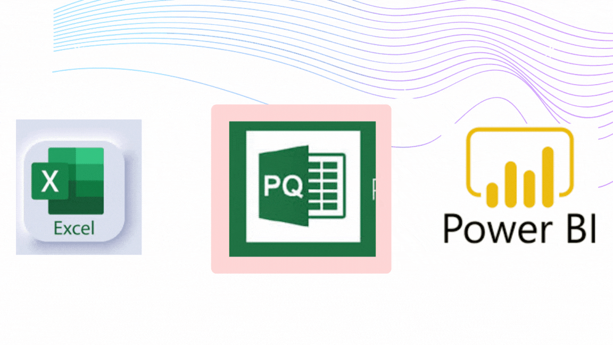
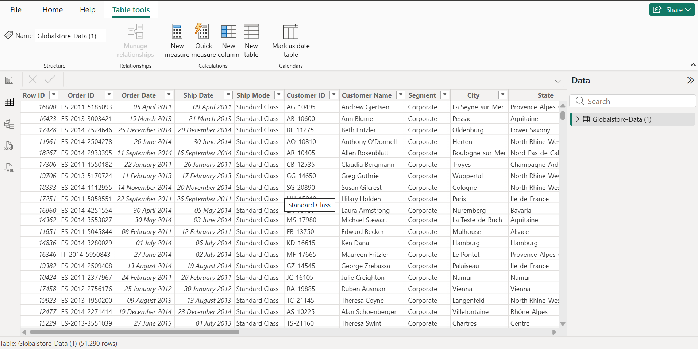
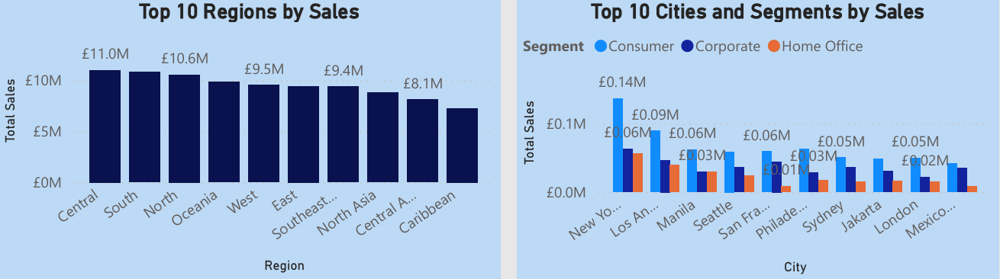

# Customer Segmentation Analysis for Data-driven Marketing Strategies
# Excel to Power BI

## Description: 
This is a Customer Segmentation Analysis Project that involves importing customer data from SQL, followed by data cleaning and transformation using Power Query. I also created interactive visualizations to identify distinct customer segments using Power BI. The main objective is to offer critical insights for informed business decision-making and the development of data-driven marketing strategies for my client.

## Data Analysis Steps/WorkFlow

### Data Extraction
Data was extracted from Excel into Power Query for Data Cleansing

### Data Cleansing/Transformation
- Validated Data
- Removed Duplicates
- Changed Data Type
- Replace null/blank columns with placeholders
- 

### Data Loading
Loaded data into Power BI for Analysis

## Key Questions
- What is the total sales volume for each customer segment (Consumer, Corporate, Home Office)?
- Which countries or regions generate the highest revenue?
- Which product categories contribute the most to overall sales?
- How do order priorities (Critical, High, Medium, Low) impact delivery times?
- Which shipping modes (Same Day, First Class, Second Class, Standard Class) are most commonly used?
- What are the most profitable customer segments, countries, and cities?
- How do discounts offered impact overall sales and profitability?
- What are the monthly or quarterly sales trends over the years?
- How do shipping costs affect the overall profitability of orders?
- Which customers contribute the most to the business over time?
- How do high-priority orders compare with low-priority orders in terms of delivery speed and customer satisfaction?
- How do customer segments perform differently across various global regions?

### Summary of Key Insights- Dashboard

### Question 1: What is the total sales volume for each customer segment (Consumer, Corporate, Home Office)?

The sales distribution shows a clear dominance of the Consumer segment:
Consumer: £6.5M is the largest contributor, accounting for most of the total revenue,
Corporate: £3.8M is a strong but secondary segment,
Home Office: £2.3M is the smallest revenue generator.

### Question 2: Which countries or regions generate the highest revenue?

The top city is New York with £256K in sales, across all segments, while the top region is the Central region accounting for 22% of total sales- £2.8M

